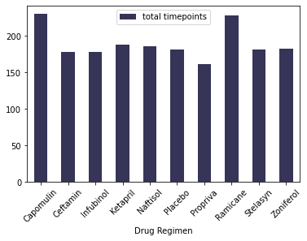
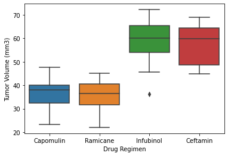
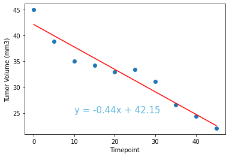
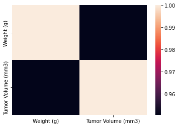
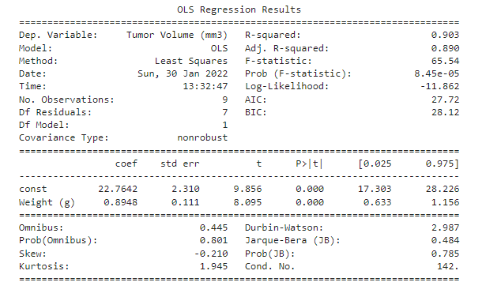

# Call to Action

1. The Seaborn boxplot shows that Capomulin and Ramicane outperform Infubinol and
Ceftamin in reducing tumor volume (mm3).

2. Weight (g) and Average Tumor Volume (mm3) are positively correlated as seen with
the correlation plot and scatter plot.

3. The Male to Female ratio is 1:1, however animal research shows that a male mouse
is not equivalent to a male human, for example. Thus, gender is not a representative
parameter if these anti-tumor drugs are to be clinically test in the human population.

## Preview of Project

  

  

  

  

  

  
