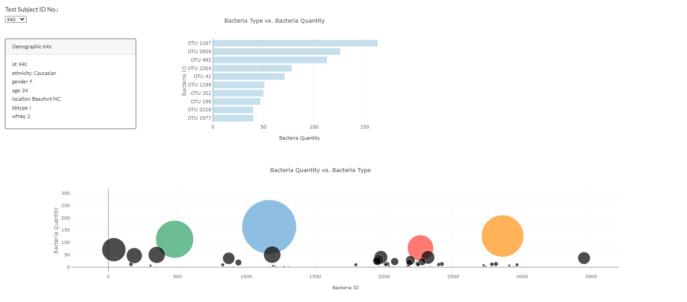
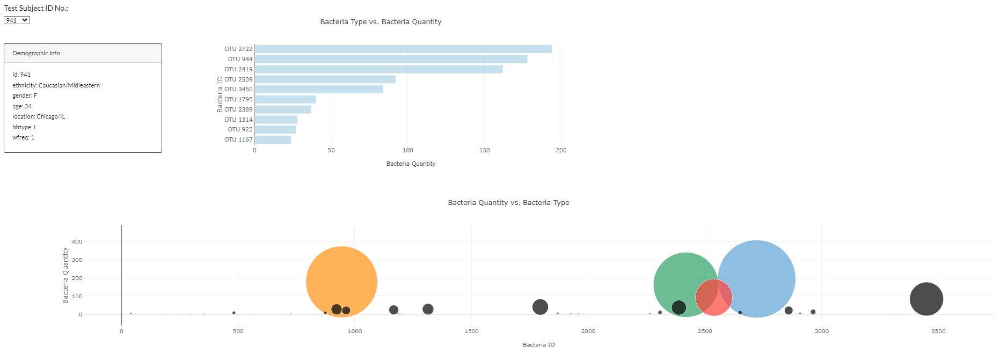

# Introduction

I built a dynamic dashboard using JavaScript and the Plot.ly library on bacteria data (https://samslomowitz2021.github.io/SMU-Portfolio/11-Interactive-Web-Visualizations/Submissions/Website/index.html).

  

  

