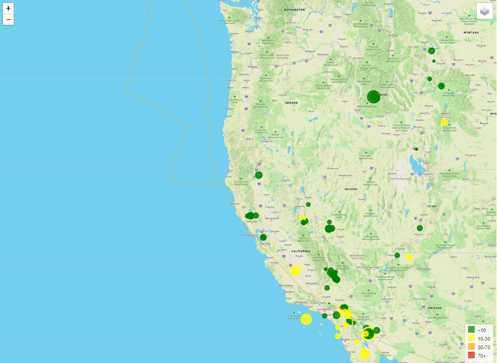
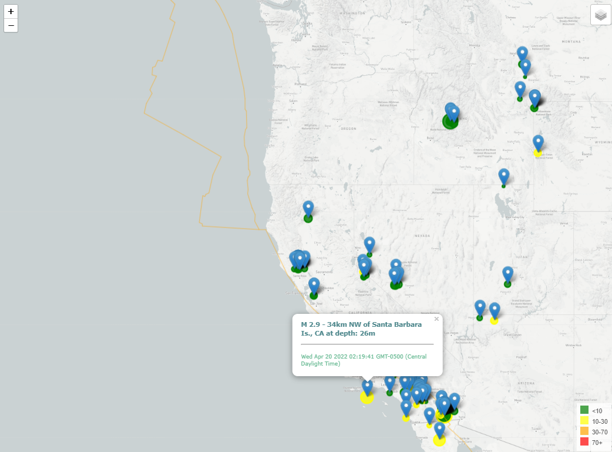

# Introduction

I created a interactive dashboard using JavaScript, Ajax, API GET requests, and real-time GeoJSON data (https://samslomowitz2021.github.io/SMU-Portfolio/12-Mapping-Web/Submissions/index.html). 

  

  

  

