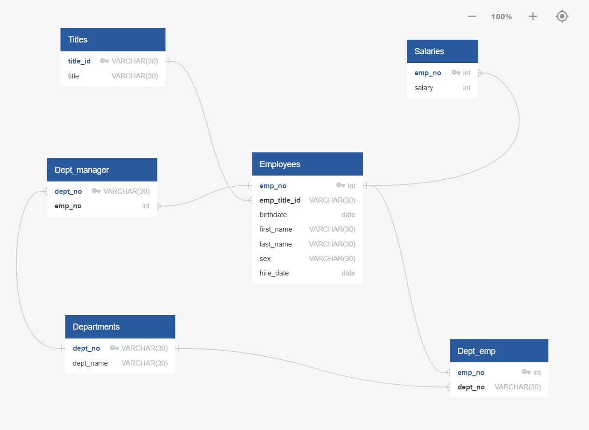

# SMU-Portfolio

## Introduction

 I am a Data Analyst, neuroscientist, and musician. VBA, Python, SQL, and Javascript are my primary computer languages. Databases, website development, and machine learning are my foundational technical skills. Data analytics fascinates me because we live in a data-driven world and business decision making can be enhanced through mathematical and statistical models. I am a team leader and public speaker. I am excited to add value to your organization. 

## Data Analytics Portfolio Preview

  

